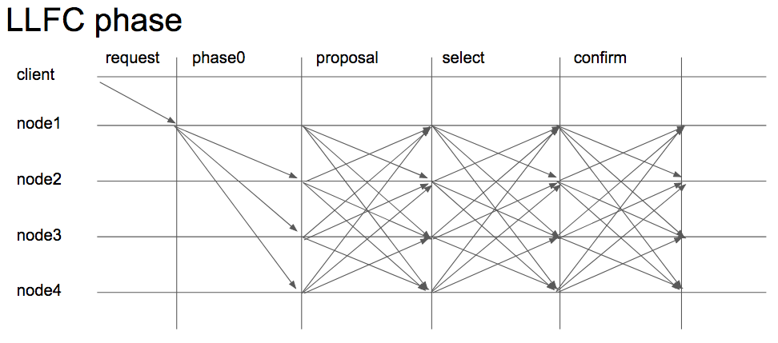
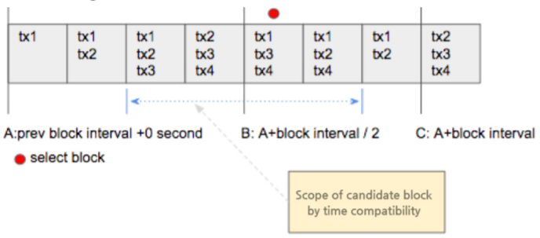
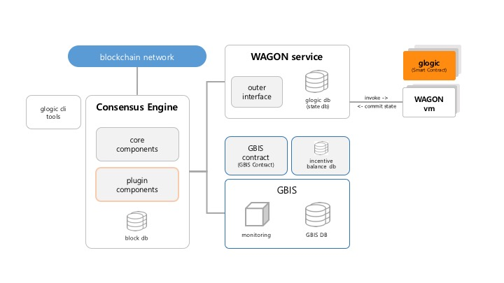

# GBrick (GBX) - Extreme fast blockchain network for rapid service

Welcome to the Official implementation of the GBrick

## Build Source

Builds are not available at this time. However, you can try peer testing.

## Running the tests

Requires for testing:

- Language: Python3.6
- Installation
```sh
virtualenv -p python3 venv
source venv/bin/activate
pip3 install -r requirement.txt
```

You can run the tests with:

- Run Gbrick Network Controller
```sh
python3 gncontroller.py
```
- Run Gbrick Peer 1 with another console
```sh
source venv/bin/activate
python3 peer.py
```
- Run Gbrick Peer 2 with another console
```sh
source venv/bin/activate
python3 peer.py -p 7300
```
- Call API Test with another console (If the Gncontroller's Rest Port is 9002)
```sh
curl http://localhost:9002/api/v1/peer/list
```
- Send Transaction to Peer Test (If the Peer's Rest Port is 9000)
```sh
curl -H "Content-Type: application/json" -d '{"data":"gBrick"}' http://localhost:9000/api/v1/transactions
```

## BlockChain Service
### LLFC (LeaderLess Fast Consensus Management)

gbrick has developed an agreement algorithm that can respond to high speeds in order
to materialize a high-speed blockchain service.
This agreement algorithm may be continuously improved in the future, so the gbrick
team is now testing various known agreement algorithms and newly modified
consensus methods.
LLFC is based on the DPOS (Delegated Proof-Of-Stake) method, and has been developed
as a method to resolve the issues of the widely known DPOS. The characteristics of LLFC
can be explained by the following keywords.

### LLFC phase



### LLFC pre-phase

- Request
Client transmits the tx request to the connected node.
- Phase0
Each node propagates the tx of the client it has received to the network.

### LLFC consensus-phase

- Proposal
First step of the LLFC phase.
- Select
Each node selects and signs one of the blocks propagated to itself according to
the specified algorithm.
- Confirm
. If there is a block selected and signed by more than 2/3 of the quorum of the
network, the particular block is applied to its block chain. At this time, this block is
already confirmed.
. The signature signed on to the applied block is collected and transmitted to the
confirm block. At this time, the block with the longest signature has
predominance.
. The nodes may update their states with block data signed by more than 2/3, and
the length of the signature is used for evaluation on GBIS.

### LLFC select algorithm



### Maximum tx

- To contain the maximum number of tx
- If the same number, the older tx takes priority.
- Discerns the tx processing ability of the node

### Time compatibility

- Must arrive within the range of the most ideal consensus time
A block that has the same number of tx as the most adjacent block is regarded to be
within the range.
- The node’s network processing ability proves the excellence of network relations.

### Proposal block hash
When creating its own proposal block hash, each node includes its own signature and
an arbitrary nonce value. (All hash values of the proposal block become different.)

### Select conflict tolerance
- To prevent failure of the consensus round due to a select conflict when identical
criteria occur in the block selection conditions, for blocks of identical criteria, the
blocks are selected according to hash priority.
- Basic conditions are in the closest order to the array of the previous block hash.
- Compensation for competing blocks may be recorded and processed on GBIS
according to the governance agreement, but for the sake of performance this is not
recommended.

### Dynamic Node Change
Representative nodes of LLFC do not assign authorities on physical addresses, but
instead assign gbrick logical addresses (identical format with wallet address). This
address may be used when exercising authority as the representative node of the DPOS
including GBX transactions, and is managed separately from the physical node address.
It thus makes physical attacks on the representative nodes difficult by exercising
authority over consensus and dynamically changing the participating nodes. It also
enables avoidance of penalties on the network due to physical errors at an early period,
thus bringing improvement of reliability for the entire network.

### Multi-Channel and Consensus Channel
LLFC generally supports multi-channels of various purposes. Each of the channels is
operated by abstracted group layers of participating nodes of a network, and LLFC’s
DPOS consensus is also performed through the consensus channel.
Nodes of LLFC can be classified into various specialized nodes that perform only certain
functions of the full node, and these nodes may subscribe to the Consensus Channel for
block and message sync.

### Vote Weight
On the gbrick DPOS, differentiated voting rights are retained depending on the
consigned conditions of nodes, but these are placed in different levels to minimize the
difference between the nodes with minimum and maximum conditions. That is to say,
the purpose is to prevent nodes that possess a large amount of gbrick coins (GBX), such
as exchanges, from unilaterally influencing consensus. The levels of vote weight are
initially determined by an agreement made among representative nodes, and may be
renewed later.

### Quorum
In LLFC, a balanced quorum must be maintained for efficiency in agreement and stability
of the network, and if the minimum quorum is not reached, a new representative node
must be elected.

To maintain the representative nature of the Consensus Channel, the maximum quorum
value may change in direct proportion to the network scale, and details that are agreed
upon are recorded on the block.

### Penalty
In LLFC, penalties may be imposed on any activity of a node that interferes with a normal
agreement process, and may be imposed on activities outside both items defined by the
penalties and normally defined items.

Penalties are carried out through deduction of GBX deposited by the authority of
representative nodes, and for items and processing of deposits and penalties, the details
agreed upon prior to opening of the main net must be announced.

This rule is defined and recorded on the main blockchain of gbrick, and may be revised
according to the agreement of representative nodes. Nodes whose deposits have fallen
short of the criteria for representative nodes due to penalties automatically lose their
rights as representative nodes.

This is applied to both physical nodes and representative node addresses that are
currently participating, and addresses that have lost the qualifications of representative
nodes cannot be assigned authority to participate in other physical nodes.

### Governance
gbrick retains decentralized and unphysical governance, and representatives of the
network may exercise their own authority through inherent addresses. 

Once the new rules of gbrick are proposed, they must be recorded on the block, which then takes effect by including the signatures of the representatives.

To participate as a new representative of gbrick, contribution to the network must be
proven, and the conditions are defined as rules. Network contribution may be evaluated
in advanced through GBIS.

### Leaderless
To solve the issue of leaders typically discussed in POS agreements, LLFC operates an
agreement method that does not have a leader.

All agreement nodes may create blocks from the list of broadcasted tx, and the proposal
block is then broadcasted as an overall agreement node. Each of the agreement nodes
selects the most suitable block from among all proposal blocks collected, and puts it to
a vote after adding signatures. The identical block selection algorithm is applied at this
point.
The proposal block selection algorithm may consider the following items.

  - Considering the network delays, conditions that will reach the whole in the most efficient and common way are to be retained,
  - It must be the most suitable block for completion of consensus within the time of the block creation period,
  - It must process the maximum amount of tx in the most efficient way possible.

However, proof by algorithm may lead to issues such as forgery of particular conditions
and generation of proposal blocks that possess duplicate conditions. If more than one
agreement round fails and is re-attempted, it may lead to a problem of increasing the
number of blocks that correspond to optimal conditions.

LLFC utilizes a part of the Nonce proof method in order to avoid such algorithm selection
issues.

Other than the time and tx needed to make the proposal conditions identical, nodes add
arbitrary Nonce to avoid overlap of block hash. In this case, however, the optimal
conditions of the created hash are selected again as an algorithm unlike POW’s Nonce
proof, which extends it until a specified hash is deduced.

Through this method, LLFC enables creation and selection of a leaderless block. All
agreement nodes are able to select and sign for the identical block without additional
network messages.

  - LLFC is an agreement algorithm based on DPOS that does not need to specify a leader.
  - This is a method in which all nodes select the most suitable block from among all generated blocks according to the order of priority of algorithm instead of a specific leader selecting a created block.
  - If blocks with identical order of priority of algorithm selection are generated, POW elements are utilized to select common blocks without addition of network messages among nodes.
  - This is an algorithm to which all elements optimized for high-speed agreement are applied, among the currently known blockchain consensus algorithms, and it simultaneously minimizes the generally known weaknesses of DPOS.

### GBIS ( gbrick Incentive System )
gbrick offers compensation with gbrick coins on nodes contributing to the network in
accordance with the Incentives System.

In principle, it aims to redistribute treasury balance with an accumulation of fees, and
may include distribution of the additional GBX generated.

Incentive rules are written in the glogic format, recorded on the block and executed in
the incentive period, which then records the remaining distributed balance in the
incentive balance database. Distributed tx is not generated on each node’s address
immediately after its implementation.

The remaining balance of the incentive balance database may be claimed by a node
possessing particular rights after requesting a withdrawal, and at this time a separate
fee occurs for the requested tx.

### WAGON (webassembly grid over network)
gbrick's smart contract was named glogic.
glogic takes the wasm binary form of webassembly. gbrick offers a tool to convert C/C++
and solidity into glogic and test it.

WAGON is an independent subsystem inside the gbrick node, and a container that loads
and executes glogic specified by the tx of the block.

WAGON manages the state database created by execution of glogic, and provides
integrity information to the gbrick main process.

### WAGON Architecture


### WAGON Components
- glogic cli tools
  - Registration of written glogic on GBRICK is requested through the glogic cli tools.
  - glogic, for which registration has been requested, goes through a code stability test and obtains a certified signature through the governance.

- WAGON
  - Loads gblogic recorded on the block
  - Executes tx, which has been requested to a particular glogic address, and creates or renews the blogic database

- GBIS
  - The status of each node’s contribution to the network is monitored.
  - Incentives are calculated based on the GBIS contract registered according to the specified intervals by the governance.
  - Calculation is performed for blocks written based on executed intervals only and completed details are recorded on the incentive balance db.
  - However, a GBIS contract may take a long time to execute so is executed on GBIS, not WAGON.

The gbrick Blockchain Service owns various verified technologies that are fast, reliable,
and unique to gbrick (LLFC, GBIS, GLOGIC, WAGON, etc.) as explained above, and by
applying them to the gbrick platform we aim to provide an optimized gaming service.

## General Information

For more information about GBrick, visit the website at https://gbrick.io or read the whitepaper in one of the following languages:

 - [English](https://gbrick.io/files/whitepaper/gbrick_WP_r0.987_Eng.pdf)
 - [Korean / 한국어](https://gbrick.io/files/whitepaper/gbrick_WP_r0.987_Kor.pdf)
 - [Chinese / 中文](https://gbrick.io/files/whitepaper/gbrick_WP_r0.987_Chi.pdf)
 - [Japanese / 日本語](https://gbrick.io/files/whitepaper/gbrick_WP_r0.987_Jpn.pdf)

## Social Channels

| Site | Link |
|:-----------|:-----------|
| Facebook | https://www.facebook.com/gbrick.io/ |
| KakaoTalk | https://open.kakao.com/o/gQjUjiM |
| Reddit | https://www.reddit.com/user/GBXcoin |
| Twitter | https://twitter.com/gbrick2 |
| Telegram | https://t.me/gbxcoin |
| Discord | https://discordapp.com/invite/XMyJsPQ |
